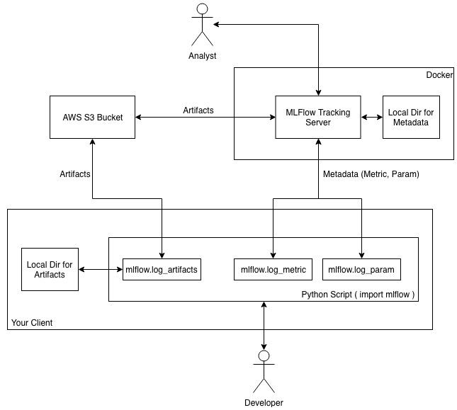

# Docker image of MLFLow Tracking Server

[](https://travis-ci.org/flmu/mlflow-tracking-server)

This repo provides a docker image of [MLFLow Tracking Server](https://www.mlflow.org/docs/latest/tracking.html) based on an internal file system for metadata (e.g. parameters, metrics) and an [AWS S3 Bucket](https://aws.amazon.com/s3/) for [files and artifacts](https://www.mlflow.org/docs/latest/tracking.html#storage).



## Prerequisites
Before you start the MLFlow Tracking Server, you must create an AWS S3 Bucket and the corresponding credentials.
1. [AWS Account](https://aws.amazon.com/?nc2=h_lg)
2. [AWS CLI](https://docs.aws.amazon.com/cli/latest/userguide/cli-chap-install.html)
3. Create a new AWS [S3 Bucket](https://docs.aws.amazon.com/AmazonS3/latest/gsg/CreatingABucket.html)
4. Add a new [AWS User](https://docs.aws.amazon.com/IAM/latest/UserGuide/id_users_create.html#id_users_create_console) to to the system
5. Assign the following policy to the user:
```json
{
    "Version": "2012-10-17",
    "Statement": [
        {
            "Sid": "VisualEditor0",
            "Effect": "Allow",
            "Action": [
                "s3:ListAllMyBuckets",
                "s3:HeadBucket"
            ],
            "Resource": "*"
        },
        {
            "Sid": "VisualEditor1",
            "Effect": "Allow",
            "Action": "s3:*",
            "Resource": [
                "arn:aws:s3:::<_AWS_BUCKET_NAME_>",
                "arn:aws:s3:::<_AWS_BUCKET_NAME_>/*"
            ]
        }
    ]
}
```

## Run the MLFlow Tracking Server

```bash
$ docker run \
    --rm \
    --name mlflow-tracking-server \
    -p 5000:5000 \
    -e PORT=5000 \
    -e FILE_DIR=/mlflow \
    -e AWS_BUCKET=<YOUR_AWS_BUCKET> \
    -e AWS_ACCESS_KEY_ID=<YOUR_AWS_ACCESS_KEY_ID> \
    -e AWS_SECRET_ACCESS_KEY=<YOUR_AWS_SECRET_ACCESS_KEY> \
    foxrider/mlflow-tracking-server:0.2.0
```

Access to http://127.0.0.1:5000

## Environment Variables for the MLFlow Tracking Server

### Required

|Key|Description|
|---|---|
|`FILE_DIR`|Directory for artifacts and metadata (e.g. parameters, metrics)|
|`AWS_BUCKET`|Name of AWS S3 Bucket that will contain the artifacts|
|`AWS_ACCESS_KEY_ID`|AWS-Access-Key that you have created in the `Prerequisite` section|
|`AWS_SECRET_ACCESS_KEY`|AWS-Secret-Access-Key that you have created in the `Prerequisite` section|

### Optional

|Key|Description|Default|
|---|---|---|
|`PORT`|Value for `listen` directive|`5000`|

## Test the MLFlow Tracking Server
### Prerequisite

1. Install the [AWS CLI](https://docs.aws.amazon.com/cli/latest/userguide/installing.html)
2. Add the AWS credentials to the client. You can either [set the environment variables](https://www.schrodinger.com/kb/1842) `AWS_ACCESS_KEY_ID` and `AWS_SECRET_ACCESS_KEY` on your client or use the [AWS CLI](https://docs.aws.amazon.com/cli/latest/userguide/cli-chap-getting-started.html) command `aws configure`.

### Simple Python Script

See this [link](mlflow_client_examples/test.py)

## Author

Florian Muchow ([@flmu](https://github.com/flmu))
